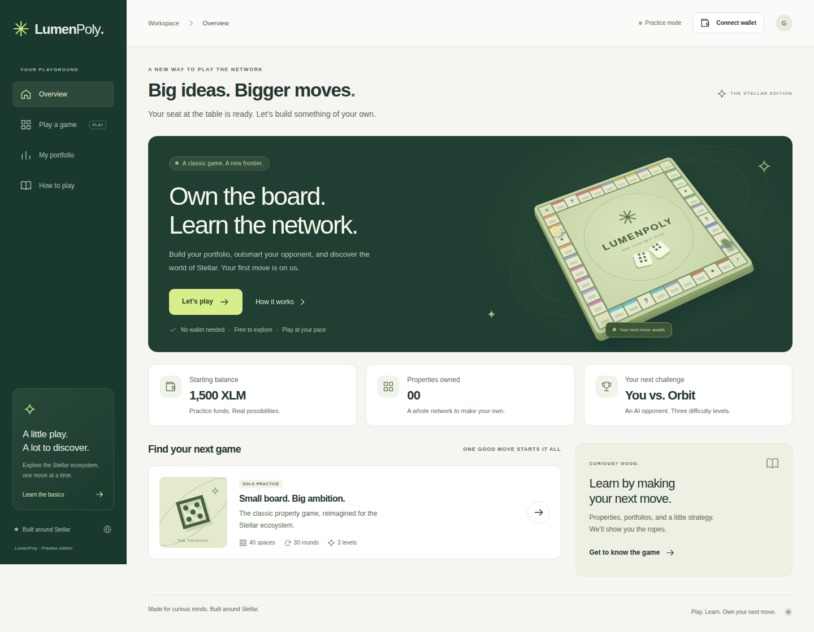
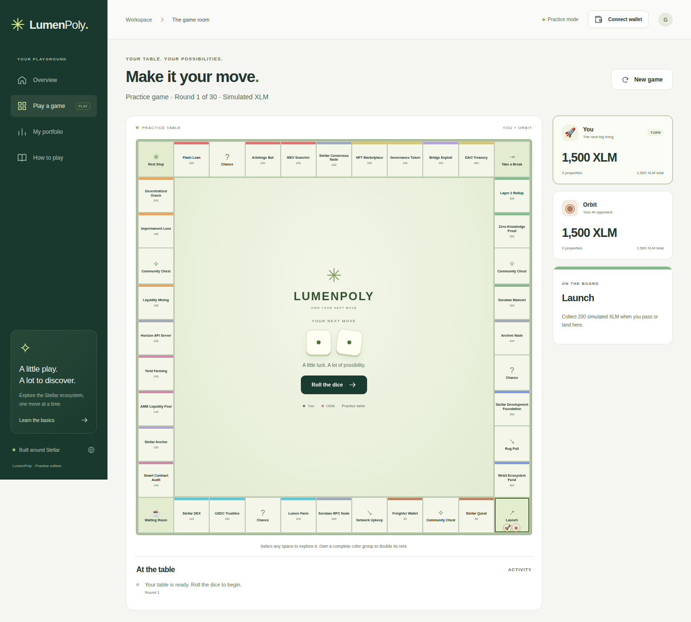
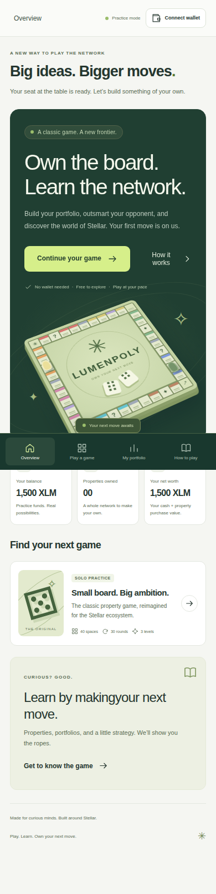
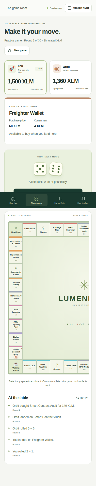

<div align="center">
  
  <h1>LumenPoly</h1>
  <p><strong>Own the board. Learn the network.</strong></p>
  <p>A Stellar-inspired strategy game for curious minds.<br />Build a portfolio, challenge an AI opponent, and discover the ecosystem—one move at a time.</p>
  <p>
    <a href="LICENSE"></a>
    
    
    
  </p>
  <p>
    <a href="#quick-start">Quick start</a> ·
    <a href="#the-experience">Features</a> ·
    <a href="#how-to-play">How to play</a> ·
    <a href="#development">Development</a> ·
    <a href="#documentation">Documentation</a>
  </p>
</div>



## The experience

LumenPoly brings the familiar property-board format into a Stellar-inspired setting. Start as a guest, choose your piece, and play against **Orbit**, an AI opponent with three purchasing strategies. Explore the rules before your first roll, inspect properties as you go, and build your portfolio at your own pace.

**No wallet, deposit, or payment is required to play.**

| Feature                        | What you can do                                                                                                   |
| ------------------------------ | ----------------------------------------------------------------------------------------------------------------- |
| **Start immediately**          | Explore the dashboard and launch a practice match without creating an account or connecting a wallet.             |
| **Build your portfolio**       | Buy properties across a forty-space board, collect rent, and complete color groups for rent bonuses.              |
| **Choose your challenge**      | Play against Casual, Strategic, or Competitive Orbit, each with a different cash-reserve strategy.                |
| **Make every move count**      | Navigate event cards, fees, and cash-flow decisions before the thirty-round finish.                               |
| **Pick up where you left off** | Resume a validated local save in the same browser, with recovery from corrupt or unavailable storage.             |
| **Play across screen sizes**   | Use a viewport-sized desktop board and dedicated mobile turn controls alongside an inspectable, scrollable board. |
| **Connect when you choose**    | Share a Freighter public address through an optional connection flow loaded only on request.                      |

<details>
<summary><strong>Explore the game room and mobile experience</strong></summary>

### The game room

The board, player balances, property details, and turn controls share one workspace. Select any space to inspect it before making your next decision.



### On mobile

Navigation stays within reach, and dice controls sit outside the board's scrolling region.

<table>
  <tr>
    <th>Overview</th>
    <th>Game room</th>
  </tr>
  <tr>
    <td align="center"></td>
    <td align="center"></td>
  </tr>
</table>

</details>

## Quick start

**Requirements:** Node.js 24 and npm. No API keys, environment variables, blockchain node, or wallet extension are needed for practice mode.

Clone the repository and start the application:

```sh
git clone https://github.com/chunks-labs/LumenPoly.git
cd LumenPoly
nvm use # Optional: if you manage Node.js with nvm
cd web
npm ci
npm run dev
```

Open the local URL printed by Vite, choose **Let’s play**, select your piece and difficulty, and start your practice game.

## How to play

1. **Take your seat.** You and Orbit each begin at Launch with **1,500 simulated XLM**.
2. **Roll and explore.** Move around forty spaces. Passing or landing on Launch earns **200 XLM**.
3. **Buy or move on.** Purchase an available property at its listed price, or keep your cash. Landing on an opponent's property costs rent.
4. **Build a strategy.** Complete a color group to double its rent. Balance purchases against fees, event cards, and upcoming payments.
5. **Own the finish.** After **thirty rounds**, the highest net worth—cash plus property purchase value—wins. An unaffordable mandatory payment ends the match early.

Read the [complete rules](docs/game-rules.md) for event cards, the waiting room, AI reserves, ties, and bankruptcy. The same essentials are available in the app's **How to play** section.

## Stellar integration and current scope

LumenPoly uses Stellar ecosystem concepts as the setting for an educational game. The application distinguishes the playable practice experience from its experimental blockchain work.

| Area                                | Current implementation                                                                                                    |
| ----------------------------------- | ------------------------------------------------------------------------------------------------------------------------- |
| Game rules and balances             | Run locally in the browser. All displayed game XLM is simulated and has no monetary value.                                |
| Freighter                           | Optional public-address connection. Connecting does not fund a match or trigger a signature.                              |
| Saved games                         | One match per browser and origin, stored locally. Clearing site data removes the save; saves do not sync between devices. |
| Soroban contract                    | Earlier experimental Rust implementation in [`contracts/`](contracts/). The practice frontend does not call it.           |
| On-chain settlement and multiplayer | Not implemented in the current frontend.                                                                                  |

The experimental contract and practice engine do not yet implement equivalent rules. Real-asset gameplay would require a separate contract review, authoritative state synchronization, transaction handling, and integration testing. See the [architecture notes](docs/architecture.md) for these boundaries.

## Development

Run the following commands from `web/`:

| Command              | Purpose                                                                               |
| -------------------- | ------------------------------------------------------------------------------------- |
| `npm run dev`        | Start the development server.                                                         |
| `npm run check`      | Run formatting checks, lint, unit tests, TypeScript checks, and the production build. |
| `npm test`           | Run game, persistence, and board regression tests.                                    |
| `npm run test:watch` | Watch unit tests while developing.                                                    |
| `npm run test:e2e`   | Run Chromium interaction, layout, and accessibility checks.                           |
| `npm run format`     | Format application source, configuration, and tests.                                  |
| `npm run build`      | Generate the production site in `web/dist/`.                                          |
| `npm run preview`    | Preview the production build locally.                                                 |

Install the browser before running the end-to-end suite:

```sh
npx playwright install chromium
npm run test:e2e
```

If Google Chrome is already installed, you can instead use:

```sh
PLAYWRIGHT_CHANNEL=chrome npm run test:e2e
```

### Quality and accessibility

The repository includes regression coverage for purchases, rent, turn order, AI behavior, bankruptcy, match results, and save recovery. Browser tests exercise guest onboarding, wallet absence, persistence, navigation, and full-board visibility across desktop and tablet sizes.

Automated WCAG A/AA audits cover the overview, setup, game room, rules, portfolio, and wallet dialog. The interface also provides keyboard-accessible dialogs, focus restoration, a skip link, reduced-motion support, and high-contrast styles.

[Frontend CI](.github/workflows/frontend.yml) runs the checks for frontend changes. [Validation notes](docs/validation.md) record local test results and limitations; a real Freighter approval and the experimental Rust contract are outside those recorded frontend checks.

### Production hosting

Build with `npm run build` and deploy `web/dist/` to a static host. The frontend requires no application server or wallet secrets. Navigation is held in memory: refreshing returns to Overview, where a saved match can be resumed. Game-room and wallet functionality load in separate chunks.

## Built with

| Layer                  | Technology                                            |
| ---------------------- | ----------------------------------------------------- |
| Interface              | React 19, TypeScript 6, semantic HTML, and native CSS |
| Build tooling          | Vite                                                  |
| Application state      | Zustand with a typed, immutable game engine           |
| Optional wallet access | `@stellar/freighter-api`                              |
| Quality tooling        | Vitest, Playwright, axe-core, Oxlint, and Prettier    |
| Experimental contracts | Rust and the Soroban SDK                              |

## Repository guide

```text
LumenPoly/
├── .github/workflows/     Frontend continuous integration
├── contracts/            Experimental Soroban contract
├── docs/                 Rules, architecture, design, and validation
│   └── screenshots/      Desktop and mobile application previews
└── web/
    ├── e2e/              Browser and accessibility checks
    ├── tests/            Game-rule and persistence regression tests
    └── src/
        ├── components/   Dashboard, board, dialogs, and learning views
        ├── data/         Board spaces, cards, pieces, and lessons
        ├── game/         Match transitions and economic rules
        ├── hooks/        Bot-turn lifecycle and optional wallet access
        ├── lib/          Storage, formatting, and board layout
        ├── store/        Navigation and match orchestration
        └── styles/       Visual system and responsive layouts
```

## Documentation

| Guide                                 | Contents                                                              |
| ------------------------------------- | --------------------------------------------------------------------- |
| [Frontend development](web/README.md) | Local commands, hosting, persistence, and manual wallet verification. |
| [Game rules](docs/game-rules.md)      | Turn sequence, economy, AI strategies, and win conditions.            |
| [Architecture](docs/architecture.md)  | State ownership, persistence, rendering, and integration boundaries.  |
| [Design](docs/design.md)              | Visual direction, interaction choices, and accessibility.             |
| [Validation](docs/validation.md)      | Recorded test evidence, production screenshots, and limitations.      |

## Contributing

Bug reports, accessibility improvements, gameplay fixes, and documentation contributions are welcome. [Open an issue](https://github.com/chunks-labs/LumenPoly/issues) with reproduction steps and your browser or screen size when relevant.

For a code contribution, create a focused branch, describe the behavior being changed, and run `npm run check` from `web/`. Run the browser suite for interface changes, include screenshots when useful, and add regression coverage for changes to game rules. Keep practice behavior and experimental contract work clearly documented.

## License

Distributed under the [MIT License](LICENSE). Copyright © 2026 chunks-labs.

LumenPoly is an independent educational project and is not affiliated with the Stellar Development Foundation.
